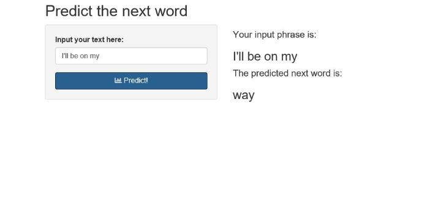
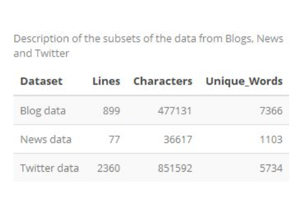
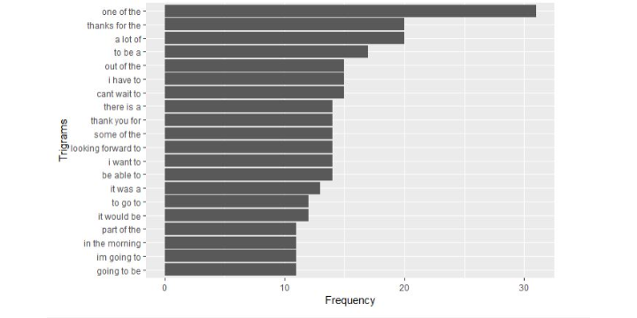

<section style="text-align:center;">
# A Shiny Application
### Part of the Course Project Shiny Application and Reproducible Pitch
##### Author: idejong

---
## Introduction 
As part of the Coursera Data Science Capstone project, a prediction algorithm was developed that predicts the next word based on the previous words. The prediction alogrithm is deployed within a Shiny Application. 

- The Shiny Application can be accessed with the link:  https://idejong.shinyapps.io/Capstone_Wordprediction/
- This presentation was developed using the package slidify in R
- The code to reproduce the prediction algorithm, the Shiny application and the presentation can be accessed at Github using the link: https://github.com/idejong/Developing_Data_Products_CP3

---
## The data
The input data consists of English entries of blogs, news article and twitter. This input data is available [here](https://d396qusza40orc.cloudfront.net/dsscapstone/dataset/Coursera-SwiftKey.zip).

The data is cleaned in the program R, for example by removing all punctuation and removing profanity words. 

Below you will find an example of the data, which is a subset of 0.1% of the data:

---
## How the prediction algorithm works
The prediction model is an n-gram model that predicts the next item in a sequence.

- The first step after the input text has been cleaned is the creation of bigrams, trigrams, and 4-grams.
- Using a Katz's back-off model, we estimate the probability of a word given its history in the n-gram.

As an example of ngrams the most common trigrams within the input data are shown below. 

---
## How the application works
- The application presents the user with an input textbox where the user input's the desired phrase. 
- After clicking the 'Predict!' button the input is transfered to the server where the algorithm is run. 
- While the model is run, a waiting message is presented is the right corner telling us to wait a second while the next word is predicted.
- Once the prediction model is finished, both the user's input phrase and the predicted next word are presented in the shiny app.

---
